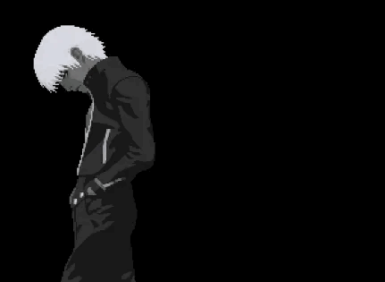

<p align="center">
  
</p>

<h1 align="center">João Victor</h1>

<p align="center">
  <b>Web Designer • Front-End Developer • Digital Creator</b>
</p>

<p align="center">
  Crio sites modernos com foco em <b>design</b>, <b>estratégia</b> e <b>conversão</b>.
</p>

<p align="center">
  <a href="https://github.com/jvctrr">
    
  </a>
  <a href="mailto:Jvictor76900@gmail.com">
    
  </a>
  <a href="https://wa.me/5585986301108">
    
  </a>
</p>

---

<table>
  <tr>
    <td width="45%">
      
    </td>
    <td width="55%">
      <h2>Know About Me</h2>
      <p>
        Sou <b>João Victor</b>, também conhecido como <b>soshito</b>.
      </p>
      <p>
        Tenho 21 anos e estudo <b>web design</b> e <b>programação web</b> desde os 15.
        Trabalho com criação de sites, landing pages, interfaces, design gráfico,
        marketing digital, copywriting, front-end e edição de vídeo.
      </p>
      <p>
        Meu foco é criar experiências digitais com visual forte, boa estrutura,
        clareza na comunicação e estratégia para conversão.
      </p>
    </td>
  </tr>
</table>

---

<h2 align="center">What I Do</h2>

```txt
WEB DESIGN       → Sites modernos, landing pages e portfólios
FRONT-END        → HTML, CSS, JavaScript, React e interfaces responsivas
DESIGN GRÁFICO   → Artes, identidade visual e criativos para redes sociais
MARKETING        → Copy, estratégia, tráfego e páginas focadas em venda
VÍDEO            → Edição, criativos e composições visuais
````

---

<h2 align="center">Tech Stack</h2>

<p align="center">
  
</p>

---

<table>
  <tr>
    <td width="50%">
      <h2>Top Projects</h2>
      <p>
        <b>portfolio</b><br>
        Portfólio pessoal com foco em design, interação e apresentação profissional.
      </p>
      <p>
        <b>landing pages</b><br>
        Páginas criadas para vender, apresentar ofertas e gerar contatos qualificados.
      </p>
      <p>
        <b>digital interfaces</b><br>
        Interfaces modernas com foco em experiência, estética e conversão.
      </p>
    </td>
    <td width="50%">
      
    </td>
  </tr>
</table>

---

```txt
Email    → Jvictor76900@gmail.com
GitHub   → github.com/jvctrr
Discord  → Hitorishh
```

---

<p align="center">
  
</p>

<p align="center">
  <b>Minimal. Dark. Strategic.</b>
</p>

<p align="center">
  <i>Design that looks good. Strategy that converts.</i>
</p>
```
